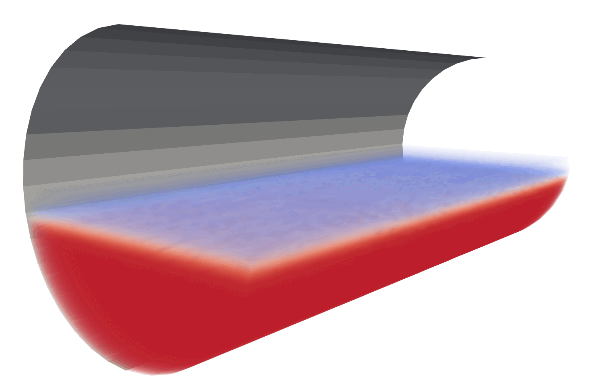

# Flow of granular materials in a rotary kiln.

**Authors:** L. Plato, M. Sliwinski, D. Peschka

**Language:** Python + FEniCS

**Description:** This documentation describes a coupled phase-field and flow model, combining the Allen–Cahn equation with incompressible Stokes flow. This is a first step towards the simulation of a rotary kiln (the granular flow aspect of it) as a problem considered in a  European Study Groups with Industry at NTNU Trondheim (**ESGI 186 – the Norwegian Study Group with Industry**).

## Allen–Cahn–Stokes model for rotary kiln

We consider a domain $\Omega \subset \mathbb{R}^d$ (rotary kiln $d=3$ or a cross-section $d=2$) and a phase-field variable $\varphi : \Omega \times [0, T] \to [0, 1]$, where $\varphi \approx 1$ denotes the granular phase and $\varphi \approx 0$ denotes the gas phase.

### 1. Allen–Cahn equation (with advection)

The phase field evolves according to:

$$
\frac{\varphi^{k+1} - \varphi^k}{\tau} + \mathbf{v}^* \cdot \nabla \varphi^{k+1} = m\left[-\varepsilon \Delta \varphi^{k+1} + \frac{2}{\varepsilon} \varphi^{k+1} (2(\varphi^{k+1})^2 - 3\varphi^{k+1} + 1)\right],
$$

where:

* $\tau$ is the time step,
* $m$ is the mobility,
* $\varepsilon$ is the interface width,
* $\mathbf{v}^*$ is the velocity field from the Stokes problem (potentially averaged between $k$ and $k+1$).

### 2. Stokes flow with $\varphi$-dependent viscosity

The velocity $\mathbf{v}$ and pressure $p$ satisfy:

$$
-\nabla \cdot \sigma(\varphi^k,\nabla\mathbf{v}^{k+1},p^{k+1}) = \mathbf{f}_{\text{grav}}(\varphi^k), \quad \nabla \cdot \mathbf{v}^{k+1} = 0,
$$

with:

* $\sigma = -p\mathbb{I}+2 \mu(\varphi) \boldsymbol{\varepsilon}(\mathbf{v})$ (Cauchy stress),
* $\boldsymbol{\varepsilon}(\mathbf{v}) = \tfrac{1}{2}(\nabla \mathbf{v} + \nabla \mathbf{v}^T)$ (symmetric gradient),
* $\mu(\varphi) = \mu_s |\varphi| + \mu_g |1 - \varphi|$ (interpolated viscosity),
* $\mathbf{f}_{\text{grav}}(\varphi) = \mathbf{g} \varphi$ (gravity acting in one granular phase).

Boundary terms include slip and penalty constraints

$$
t\cdot\sigma n = \beta_{\text{slip}}(v-v_{\text{rot}})\cdot t,\qquad n\cdot\sigma n = \beta_{\text{pen}}v\cdot n
$$

which for $\beta_{\text{pen}}\gg 1$ should lead to $v\cdot n=0$ and for $\beta_{\text{slip}}\gg 1$ to $(v-v_{\text{rot}})\cdot t=0$.

**Reference:**
* Gray, J. M. N. T. (2001). [Granular flow in partially filled slowly rotating drums](https://doi.org/10.1017/S0022112001004736). Journal of Fluid Mechanics, 441, 1-29.

**Running the code**
* [install *FEniCS legacy* for example using the package manager conda](https://anaconda.org/conda-forge/fenics)
* For the 3D kiln simulation create a directory with the folder name `./src/kiln3D/`
* Run the example of your choosing: `2D_disc.py`, `2D_rectangle.py`, `3D_kiln.py`
* For the 3D example run the jupyter notebook `postprocessing.ipynb`
* Use [Paraview](https://www.paraview.org) to visualize the created `vtk` data 